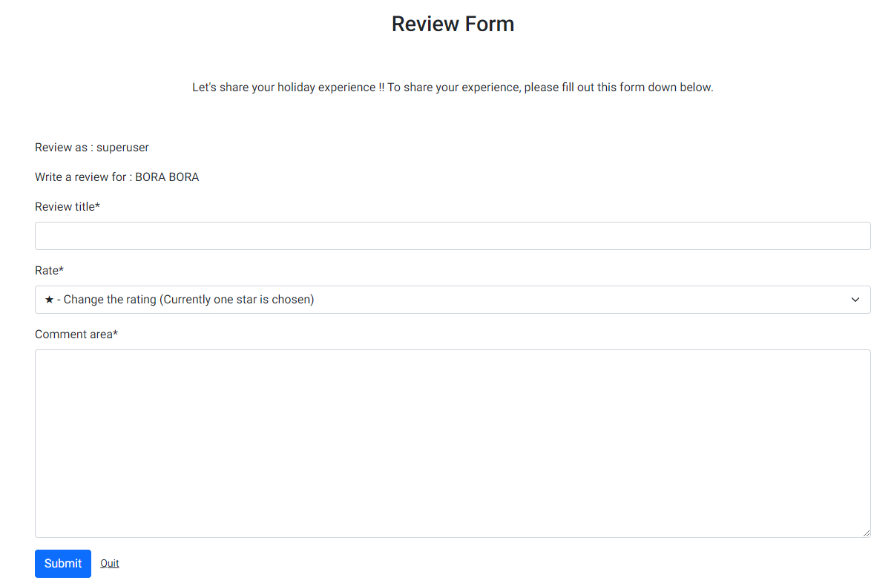
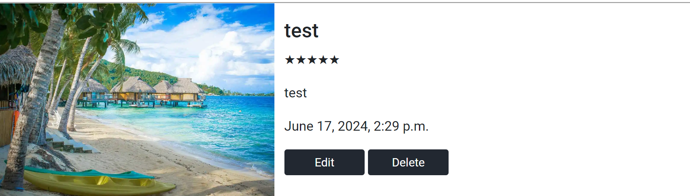
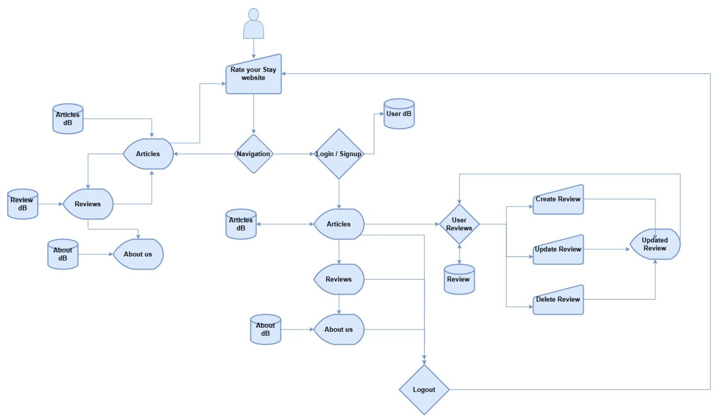

# Rate Your Stay

This is the fourth project in the code institute diploma in full stack software development. It is a full stack website designed for travellers to visit where they can provide travel reviews for people who are thinking about travelling and also people who want to to just browse what the site has to offer. The backend of the project was built using Django, Python and a Postgres relational database to store the site's data. The project is deployed using Heroku. The project was managed using githubs built in boards so I could create Sprints to track the Epics and user stories.

[Github - Rate Your Stay](https://github.com/Chikayo-k/rate-your-stay)  
[Heroku - Rate Your stay](https://rate-your-stay-6127331291d1.herokuapp.com/)

## Design

### Colour Schemes

As this is a holiday review website, I decided not to use too many colours but colours that would make the pictures stand out. Orange will be used for buttons to stand out. This will make it easier for users to navigate through the website.

[Colour Hunt]( https://colorhunt.co/palette/2228312d4059ff5722eeeeee )

### Fonts

- Cinzel font type is used for the website logo 
[Google Fonts - Cinzel](https://fonts.google.com/specimen/Cinzel)

- Roboto font style is used for the entire page 
[Google Fonts - Roboto](https://fonts.google.com/specimen/Roboto?preview.text=Rate%20Your%20Stay&stroke=Sans+Serif )

### favicon

### Wireframes

**Desktop**

[Desktop Image 1](docs/wireframes/wireframe-pc1.jpg)  
[Desktop Image 2](docs/wireframes/wireframe-pc2.jpg)  
[Desktop Image 3](docs/wireframes/wireframe-pc3.jpg)  
[Desktop Image 4](docs/wireframes/wireframe-pc4.jpg)  
[Desktop Image 5](docs/wireframes/wireframe-pc5.jpg)  

**Tablet**

[Tablet Image 1](docs/wireframes/wireframe-tablet1.jpg)  
[Tablet Image 2](docs/wireframes/wireframe-tablet2.jpg)  
[Tablet Image 3](docs/wireframes/wireframe-tablet3.jpg)

**Phone**

[Phone Image 1](docs/wireframes/wireframe-phone1.jpg)  
[Phone Image 2](docs/wireframes/wireframe-phone2.jpg)  
[Phone Image 3](docs/wireframes/wireframe-phone3.jpg)

## Project Goals

### Project Goal

The goal of this project is to create an interactive space where travellers from all over the world can share their travel experiences, tips, and guides. The website should provide users with a simple user interface. A good understanding of what the site provides and what it offers.

### Target Audience

- People who travel a lot and enjoy sharing their experiences.
- People who are planning to travel and want to get a feel for the places they are going.

### User Goals

- As a site user I want to explore holiday ideas and also want to know other people's opinions.

- As a site user I want to be able to create an account so I can login and add reviews of places I have visited. I want to have control over the reviews I create and be able to make changes or delete them if I want. I want to be able to access the site's socials so I can share my reviews with family and friends not using the site. I want to be able to view reviews left by other people.

- As a site user who does not have an account I want to be able to view the articles on the site and read reviews that have been left by people that can help me plan a trip.

- As a site user I want to be able to log out of the website and keep my details safe and secure.

### Site owner goals

- As a site owner I want to offer a platform that will connect people and let them share their reviews on locations they have visited.
- As a site owner I want to grow the site by using social media to share details.

## User Experience (UX)

### Project Features

#### Navigation bar

- The site uses a responsive navigation bar made up of four pages, these are the Home page, About Us, Register, and Login pages. It also contains a simple logo just which is the name of the website. The logo and Home can be used to navigate to the top of the home page. 
- A user can easily access the other pages on the site and see what page they are currently on by looking at the menu in the navigation bar.

#### Hero Image / Login / Log Out / Ragister / leadmessage

- Login and register feature. Which has an image with some simple action buttons which gives the user a clear picture of the feature. The use of the image of someone relaxing gives the user an idea this is a holiday reviewing website. Users can see the lead message and understand the website at a glance.

- A register button and login button above the image aim to lead users to register for an account for the website which is the website owners goal. This is to increase the active users on the website. 
When a user is logged in, the buttons switch to show only a logout button. 

- When a user is logged in, the register button will change to the logout button. (Navigation bar buttun will be changed to logout as well) 
The user can see that the user is logged in clearly.

#### Article review section

- A user can click the explore button on any of the articles without an account to view reviews that have been left by users on each of the locations. User’s have easy access to jump to the details on the article page. 

- A user can view reviews without needing to sign up or create an account. This shows the user what is available on the website. It also allows more users to access the website content if they don’t want to create an account.

- Each article has an image, category, name of the place, description and the explore button.
This gives the user a better understanding of what the article is about and allows users to create an image themself what the place is like.

- The category shows users a clear understanding of what the location is famous for. The categories are Historic sites, Beaches, and Cities.

- The site has pagination where users can see up to 4 articles at a time. When on the first page users can see the next button but no previous button, when the next button is clicked it will show the next four available articles. It will also have a previous button for users to go back. When there are no more articles left the button won't be shown.

#### Detail Page

- When a user clicks on the explore button it will open this view.

- Here users can read a short article about the location and then view the reviews that have been left by people.

- Users can learn a little bit about the location and read all the reviews left by other users. This benefits users as it can help them make a decision on what kind of trip they want to take.

#### Review Section

- The write a review button only shows up when the user logged in. 

- There is a counter that displays how many people left the review on each article. The counter will give users a quick understanding of how popular the article is and the number of reviews without having to scroll down through the review.

- Reviews will be displayed so that users can enjoy reading them.

- Only the user who wrote the review can see the edit and delete button to prevent someone else from editing or deleting the review.

- The back to top button will be shown when there is one or more reviews at the bottom and the user has scrolled down to give the user the ease of returning to the top by the click of a button.

#### Review form

- The review form is only visible when the write button is clicked otherwise it is hidden. This will give the website a cleaner look and only show things when the user wants to see them.

- When a user is ready to submit a review they can click the submit button, This will send their details to be stored in the database and allow other users to view it on the website. 

- There is a quit button beside the submit button which will allow users to quit their current action. This will remove everything they have entered and refresh the page so the form will disappear and nothing will be stored in the database. The submit and quit buttons make it easy for users to add their reviews to the website and to cancel a review before adding it if they want.

#### Edit form

- This is for when a user wishes to update their review.

- Users can be sure that only they can edit their reviews as this feature only shows when a user is signed in. The edit form is filled out with all the info they filled in previously and they can change it from here. User can easily update their review.

- There is a quit button located beside the update button that will allow a user to quit out of an edit, remove the pop up and refresh the page.

- After updating the review, the banner shows up. The user can see the review has just been updated and was successfully done.

#### Delete Review

- When you click the delete button of the review, the module pops up and asks if the user wants to delete the comment with a confirmation box. 

- This option will allow users to make sure they don’t delete their review by mistake.

- After clicking the delete button, the banner shows up underneath of the navbar to say the review has been deleted successfully.

#### Register

- When A user clicks the register button they will see a form to enter details to create an account. Users can set up their account with a username and personal password.

- When a user creates an account they can add, edit and delete reviews.
This page is created separately so that the user can focus on creating their account and follow the password practices of account creation.

- After creating an account、User will see a successful banner message. The user sees that the account has been made without any issue.

#### Log In 

- When a user has already created an account they can sign in by clicking the login button.

- When the user is logged in, they can edit and delete reviews they have created.
This makes sure only the user who wrote the review has control of their review. And users can make changes after their initial post anytime when they are logged in.

- After logging in、the user will see a successful banner message. 

#### Log Out

- The user can log out using either the logout button on the navigation bar or the button on the hero image.

- After clicking the logout button, another page appears asking the user to confirm they want to log out again.

- When a user is logged out they can view their reviews on the site like all other users.

- This provides clear navigation for the user to logout.

#### About page 

- The about page shows information about the site.

- Users can read the about page to find out more information about the site and what they offer.

#### Footer

- The footer is at the bottom of the page and has links to the help centre and social media sites.

- Users can view the social media sites for Rate you Stay and follow us on those platforms if they want to learn more about us. Users can also access the help centre if they are facing any issues.

#### Help Center

- This is to support users if they face any trouble on the site.

- Users can click this and a module will pop up where users can get an email address where they can contact us for any issues they may have and they can get support.

### Future Features

Future features will allow all users to upload their own images to the site as part of their reviews. There will also be a My page added which will have all the users reviews in a single page and give them more control over their content. The admin will also have the ability to review all of a user’s reviews.

## Project Structure:

**The project will be made up of six pages consisting of:**

- The landing page, the first page a user will see after logging in, will display a selection of reviews and articles.

- Detail page, this will show a selection of reviews from the various categories available. For example, reviews based on beaches/cities or historic sites.

- Create a review page, Users can create reviews on articles where they can share their  experiences with other travellers and people planning to travel. 
- About Us page, details on the site.

- Login and register page, The user can log in or create an account.

- Logout page, This will close all current user actions and display a logout message.

### Database Model

### Flow Diagram

### Technologies used

**Main technologies used:**

- HTML - Used to create the basic design of the website
- CSS - Used to create the style of the webpages
- JavaScript - Used to add client side features
- Python - Used to build this project of backend
- Django - Main framework of  this project 
- Postgres - Used as the projects database
- Heroku - Used to deploy the project
- Gitpod - Used to develop the project
- GitHub - Used to track the project progress
- Bootstrap - Frontend framework

## Agile Methodology

### Overview

The Rate Your Stay application was developed using the Agile methodology.  
Using GitHub projects, I created Epics, User Stories and Milestones to track all my work.  

- I used Sprints and broke the work into Epics (large stories) and these were broken down into smaller user stories which were broken down more with tasks.  

- The user story would be finished when all the tasks had been completed.  
To track where work belongs I used labels.  

- Labels let me link my user story and epics and this can be seen visually on the board.  

- Each sprint had its board for tracking work. With three columns.

- Once all tasks are finished the Sprint can be closed off.

**To do** – these are tasks taken from the backlog into the sprint that has not yet been started.  
**In Progress** – These are the current tasks I am working on.  
**Done** – These are the tasks I have completed.  

### Sprints

I had 4 sprints which included all the work listed in the Epics and user Story section.

Sprint #1: Sprint 1  
Sprint #2: Sprint 2  
Sprint #3: Sprint 3  
Sprint #4: Sprint 4  

### Epics and User Stories

**Epic #1: Create the initial project setup**  
- User Story: As a Developer, I want to create the project structure so that I can - develop the Rate Your Stay website.

**Epic #2: Create the landing page of the website**  
- User Story: As a user, I want to understand what the website is at a glance.  
- User Story: As a user, I want to have easy navigation so that I can move through the pages on the site.  
- User Story: As a user, I want to browse the footer of the webpage so that I can see what’s there.  
- User Story: As a user, I want to be able to access the website on any device so that I can view the content.  
- User Story: As a user, I want to see if the website has social media so that I can visit them.

**Epic #3: Populate database and homepage with articles**
- User Story:  As a user, I want to be able to pick and view articles that interest me so I can plan a trip.
- User Story: As a user, I want to be able to see images of the places I want to view so that I can get a picture of what they are like.
- User Story: As site owner, I want to be able to see proper styling through the website, so that it is consistent.
- User Story: As a user, I want a more readable layout so I am not overwhelmed with information.

**Epic #4: Create Details and about us pages**
- User Story: As a user, I want to see the Details page clearly so that it is easy to find information.
- User Story: As a user, I want to add reviews so that people can see them.
- User Story: As a user, I want to see the About pages so that I can learn more about the website.

**Epic #5: Authentication**
- User Story: As a user, I want to be able to login and logout of the website so I can add reviews.
- User Story: As a user, I want to be able to create an account so I can have access to account-specific views.
- User Story: As a user, I want to have control over my reviews so that I can update and delete them.

**Epic #6: Project clean up**
- User Story:  As a developer, I want to tidy up the project and make sure it meets all the requirements.

## Testing
For Testing details go to a separated file. [TESTING.md](TESTING.md)

##  Bugs/Improvements

**Case 1**

When developing the path URL for the admin functionality it was created but when it was used it did not register.  
The error message showed a list of URL’s but it didn’t seem that the admin url was on the list.   
Looking further it said it was a match for the last one. What happened was Django was moving down through the list and it would reach an empty path that points to home.urls this was then jumping to urls.py and going through that list.  
To resolve this issue, I had to rearrange how the URL’s were laid out so that the admin would be read before the empty list. This solved the issue.

**Case 2**

When there is no user logged in, some of the event handlers will get an error as the elements they are looking for are hidden.

 To solve the issue, I used the try catch method to handle this type of error.

**Case 3**

When running the Lightning house validations it showed that the background colour of the button didn’t have enough contrast. 

It was adjusted and the lightness was increased to pass the contrast ratio validation.

**Case 4**

There was a warning that showed this section lacked a heading.To solve this issue, I added the h3 tag "Holiday Reviews" as the title of the section.

**Case 5**

There was an attribute error by using review_id, To solve this issue I added ‘data-’ in front of ‘review_id’ to make it data-review_id.

**Case 6**

To render the data stored in the database using the Summernote format, It wasn’t necessary to use the html tag, I got a few tag errors as I was using the html tags around them. Therefore I removed them and just accessed variables by using {{ }}.

**Case 7**

(Python Linter test)  
There were E501 errors that the lines were too long.
To solve this issue, I searched through the code institute slack channel and found that a student had found a way to solve the problem by adding # noqa at the end of the code that had the issue. 

**Case 8**

There were Mixed content warnings.

To solve this issue, I added a meta tag in the head section.
[Reference](https://web.dev/articles/fixing-mixed-content#fixing_mixed_content)

## Deployment

#### Clone

1. Clicking on the code dropdown in the main repository.
2. Copying the SSH URL
3. I opened my git bash terminal and cloned the project to a folder on my desktop.

#### Fork

A Git fork is when an existing repository has a copy taken of it and it becomes its new repository no longer being attached to or tracking the commits of the original repository. I used the original project I had cloned at the start. I could not fork the project the repository as I am the owner but the steps to fork are

1. Open the repository on GitHub and select the Fork dropdown
2. Click fork you will have a full copy of the repository.

#### Heroku

The code is stored on GitHub.  
The project was deployed using HEROKU.

1. Create requirements for deployment on the project file.
2. Create a Heroku account and set it up if needed.
3. Click the Create New App button.
4. Name the App and select a region then click Create App.
5. Click the settings tab and create the Config Vars.
6. Config vars should include CLOUDINARY_URL and DATABASE_URL.
7. Install a production-ready web server for Heroku.
8. Add requirements.txt file.
9. Create a Procfile file in the project and execute to the Django project.
10. Set setting.py where it is necessary.
11. Add buildpack select node.js and save changes.
12. Go back to the deploy section.
13. Choose the deployment method for GitHub.
14. Click the Connect to GitHub button.
15. Search for a repository name and connect to link up the Heroku App to the GitHub repository code.
16. Use the Manual deploy option and click the Deploy Branch button.
17. When the App is successfully deployed, the View button will show up. The button is the deployed link.

## Secret key issue and the changes I made

Due to an issue when the secret key was visible in the settings.py file. It made my code insecure and people could see github it in the Github repository.
The django secret key needed to be stored inside the env.py file as this poses a significant security risk on the application.
I update my code and stored my secret key in the env.py file. This has resolved my issue.

## Reference

Code

I used Code Institute study materials and the walkthrough project in coming up with the idea for my project. I used w3schools and Django documentation to check how to write code as well as the different types of methods that were available for this project.   
When I ran into an issue, I used Code Institute's tutor assistance and received great help.

- [How to retrieve multiple modal](https://qiita.com/yongjugithub/items/edd69e1ac6d4507f9ad1)
- [QuickDatabaseDiagrams](https://www.quickdatabasediagrams.com/)
- [Django W3school](https://www.w3schools.com/django/)
- [Django Documentation](https://docs.djangoproject.com/en/5.0/)
- [Mixed Content Issue](https://web.dev/articles/fixing-mixed-content#fixing_mixed_content)

Images

- [Pixabay](https://pixabay.com/images/search/holiday/)
- [Pexels](https://pixabay.com/images/search/holiday/)
- [Canva](https://www.canva.com/)

Test

- [W3C Markup Validation Service](https://validator.w3.org/)
- [W3C CSS Validation Servervice](https://jigsaw.w3.org/css-validator/)
- [JSHint](https://jshint.com/)
- [Code Institute CI Python Linter](https://pep8ci.herokuapp.com/)

