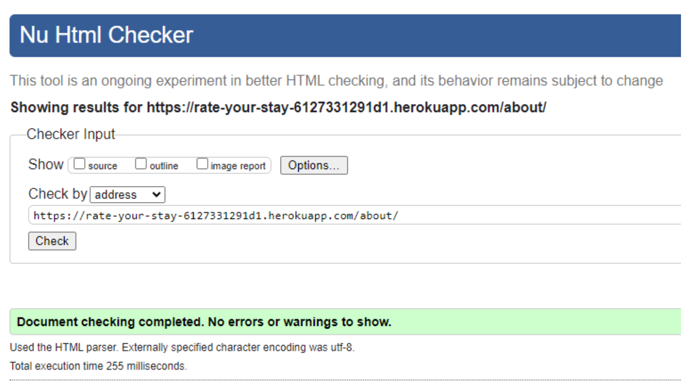

# Testing

This is the Testing section of the [README.md](README.md) file.  
It  contains all the testing information for the project Rate Your Stay.

- ### Testing User stories

User Story: As a Developer, I want to create the project structure so that I can develop the Rate Your Stay website.

- [x] Frontend and Backend of the project are created.
- [x] The database is connected to the project.
- [x] The project is deployed on Heroku.

User Story: As a user, I want to understand what the website is at a glance

- [x] The User opens up the website and sees the landing page.
- [x] The User can see a leading message on the screen.
- [x] The User can see register and log In buttons

User Story: As a user, I want to have easy navigation so that I can move through the pages on the site.

- [X] The User opens the landing page.
- [X] The User can see the navigation bar.

User Story: As a user, I want to browse the footer of the webpage so that I can see what’s there.

- [X] The user can see the Footer.
- [X] The user can see the social media icons.
- [X] The user can click the social media icons.
- [X] The user will be taken to a separate page for social media.

User Story: As a user, I want to be able to access the website on any device so that I can view the content.

- [X] The User can open the website on any device and it will have a responsive design.

User Story: As a user, I want to see if the website has social media so that I can visit them.

- [X] The user can see the Footer.
- [X] The user can see the social media icons.
- [X] The user can click the social media icons.
- [X] The user will be taken to a separate page for social media.

User Story:  As a user, I want to be able to pick and view articles that interest me so I can plan a trip.

- [X] Data is added to the database
- [X] Create cards on the home page to display the data
- [X] Users can see the articles being displayed.

User Story: As a user, I want to be able to see images of the places I want to view so that I can get a picture of what they are like.

- [X] Images are add to the database
- [X] Add images to the cards.
- [X] Users can see the images being displayed.

User Story: As site owner, I want to be able to see proper styling through the website, so that it is consistent.

- [X] Will deploy the website with fully functioning CSS

User Story: As a user, I want a more readable layout so I am not overwhelmed with information.

- [X] The page will have pagination

User Story: As a user, I want to be able to contact the help centre when I have an issue so that I can get it resolved.

- [X] User can click the button in the footer
- [X] User can see a modal open
- [X] User can see contact information

User Story: As a user, I want to see the Details page clearly so that it is easy to find information.

- [X] User can open the details page.
- [X] User can view an error message if there is a 404 response.
- [X] User can see images.
- [X] User can see content that has been added.

User Story: As a user, I want to add reviews so that people can see them

- [X] User can click a button on the details page.
- [X] Users can see a new page to add reviews.
- [X] User can write a review.
- [X] User review will be saved.
- [X] User review can be seen on the details page.

User Story: As a user, I want to see the About pages so that I can learn more about the website.

- [X] User can see the about page.
- [X] User can get to the About page from the navigation page.
- [X] User can view data on the about page

User Story: As a user, I want to be able to create an account so I can have access to account-specific views.

- [X] As a user, I can create an account
- [X] As a user, I can see a different view depending on what my user permissions are.

User Story: As a user, I want to be able to login and logout of the website so I can add reviews.

- [X] As a user, I can log in to the website and view the different pages.
- [X] As a user, I can log out the website

User Story: As a user, I want to be able to create an account so I can have access to account-specific views

- [X] As a user, I can create an account
- [X] As a user, I can see a different view depending on what my user permissions are.

User Story: As a user, I want to have control over my reviews so that I can update and delete them.

- [X] The user logs in and sees the user view.
- [X] Users can add, update and delete the reviews they have made.

User Story:  As a developer, I want to tidy up the project and make sure it meets all the requirements.

- [X] Project is complete.
- [X] Readme is complete.

## Validation

### HTML Validation

HTML validation all passed.

**Home page**

**Login Page**

**Logout Page**

**About Page**

**Detail Page**

**Register Page**

The errors from the register page are coming from the allauth template . As I have no control of this, I decided to leave this error.

### CSS Validation

CSS validation all passed.

### JSHint

JapaScript test all passed.

The JSHint validator has no error.
However, there are warnings.  
A warning saying Function declared within loops referencing an outer scoped variable may lead to confusing semantics. I decided to ignore the warning as this was just a warning and it didn’t have any impact on the code or the project.  

I used the comment out feature along with “jshint esversion: 6” to [Remove the SE6 Warning](https://teamtreehouse.com/community/why-does-jshint-give-me-these-warnings-about-es6) as these are ok to leave. 

